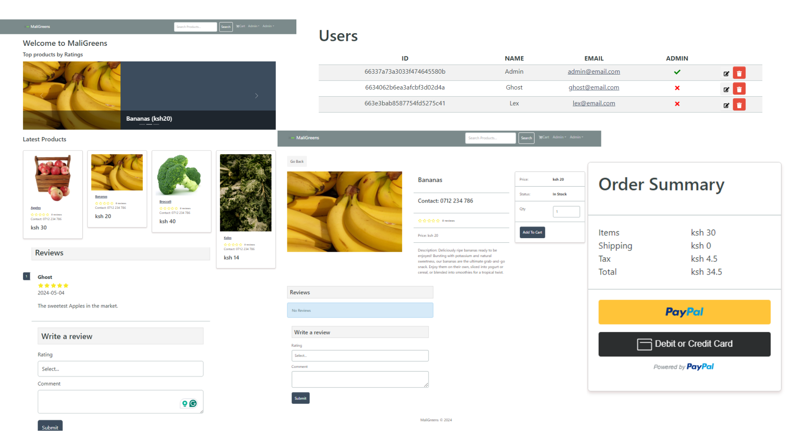

# MaliGreens Project
eCommerce platform built with the MERN stack & Redux.

This is a Fruits and Vegetables store app. Users can view featured products, add products to cart, and pay for their order. Empowers farmers and vendors to showcase their harvest, fostering a vibrant marketplace for fresh produce.


## 🔗 Links
[](https://medium.com/lexmulwa/the-maligreens-portfolio-project-8fbd27e298c1/) &nbsp; &nbsp;
[](https://alex-portfolio-lun2.onrender.com/) &nbsp; &nbsp;
[](https://maligreens-welcome.onrender.com/) &nbsp; &nbsp;
[](https://www.linkedin.com/in/alexkasema/)




## Inspiration Behind MaliGreens
Growing up I used to visit our upcountry home on almost every holiday and when schools were closed. I remember the days spent on my family’s small farm. Tending to the soil, nurturing each plant with care, and my favorite was harvesting the fruits of our labour.

Those moments shaped my deep appreciation for the beauty of nature and the hard work of farmers. The desire to bridge the gap between rural farmers, vendors, and urban consumers, to recreate that sense of community and connection, became my driving force.

And so, MaliGreens was born, a digital sanctuary where farmers, vendors, and consumers come together to celebrate the beauty of fresh produce. Inspired by the resilience of small-scale farmers and the growing demand for sustainable, locally sourced food, MaliGreens aims to empower both producers and consumers alike.


## Features

- Full featured shopping cart
- Product reviews and ratings
- Top products carousel
- Product pagination
- Product search feature
- User profile with orders
- Admin product management
- Admin user management
- Admin Order details page
- Mark orders as delivered option
- Checkout process (shipping, payment method, etc)
- PayPal / credit card integration
- Database seeder (products & users)


## Usage

- Create a MongoDB database and obtain your MongoDB URI
- Create a PayPal account and obtain your
    - Client ID
    - APP SECRET
    - Client ID
- To upload a product Create a Cloudinary account and obtain your
    - CLOUD NAME
    - API KEY
    - API SECRET


## Environment Variables

Rename the .env.example file to .env and add the following
Rename the .env.example file in the `frontend` folder to .env


`NODE_ENV=development`
`PORT=5000`
`CORS_ORIGIN=ADD_YOUR_DEVELOPMENT_URI`
`MONGO_URI=ADD_YOUR_MONGO_URI`
`JWT_SECRET=ADD_YOUR_JWT_SECRET`
`PAYPAL_CLIENT_ID=ADD_YOUR_PAYPAL_CLIENT_ID`
`PAYPAL_APP_SECRET=ADD_YOUR_PAYPAL_APP_SECRET`
`PAYPAL_API_URL=https://api-m.sandbox.paypal.com`

`PAGINATION_LIMIT=4`

`CLOUDINARY_CLOUD_NAME=ADD_CLOUDINARY_CLOUD_NAME`
`CLOUDINARY_API_KEY=ADD_CLOUDINARY_API_KEY`
`CLOUDINARY_API_SECRET=ADD_CLOUDINARY_API_SECRET`

Change the `PAGINATION_LIMIT` to what you want


## Running the App

### Install Dependencies (frontend & backend):

```bash
    npm install
    cd frontend
    npm install
```
### Run:

```bash
    # Run frontend & backend 
    npm run dev
```
```bash
    # backend only 
    npm run server
```
### Build & Deploy:

```bash
    # Create frontend prod build
    cd frontend
    npm run build
```


## Seed Database
You can use the following commands to seed the database with some sample users and products as well as destroy all data

### Run:

```bash
    # Import data
    npm run data:import

    # Destroy data
    npm run data:destroy
```
```bash
    Sample User Logins

    admin@email.com (Admin)
    123456

    john@email.com (Customer)
    123456

    jane@email.com (Customer)
    123456
```
## Contributing

Contributions are always welcome!

1. Clone repo and create a new branch: $ git checkout https://github.com/alexkasema/maligreens -b name_for_new_branch.

2. Make changes and test

3. Submit Pull Request with comprehensive description of changes


## Related

Here are some related projects

[Fruity Veggies](https://github.com/alexkasema/Fruity_Veggies) This is a Fruits and Vegetables store app.


## License

MIT License

Copyright (c) 2024 Alex Kasema

Permission is hereby granted, free of charge, to any person obtaining a copy
of this software and associated documentation files (the "Software"), to deal
in the Software without restriction, including without limitation the rights
to use, copy, modify, merge, publish, distribute, sublicense, and/or sell
copies of the Software, and to permit persons to whom the Software is
furnished to do so, subject to the following conditions:

The above copyright notice and this permission notice shall be included in all
copies or substantial portions of the Software.

THE SOFTWARE IS PROVIDED "AS IS", WITHOUT WARRANTY OF ANY KIND, EXPRESS OR
IMPLIED, INCLUDING BUT NOT LIMITED TO THE WARRANTIES OF MERCHANTABILITY,
FITNESS FOR A PARTICULAR PURPOSE AND NONINFRINGEMENT. IN NO EVENT SHALL THE
AUTHORS OR COPYRIGHT HOLDERS BE LIABLE FOR ANY CLAIM, DAMAGES OR OTHER
LIABILITY, WHETHER IN AN ACTION OF CONTRACT, TORT OR OTHERWISE, ARISING FROM,
OUT OF OR IN CONNECTION WITH THE SOFTWARE OR THE USE OR OTHER DEALINGS IN THE
SOFTWARE.

